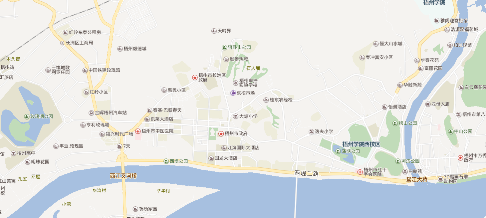

# CoolMap
一个一站式的地图发布系统.

## 提供的基础服务
- 提供JavaScript 客户端
- 提供一个Javascript API 供二次开发
- 提供一个基于Java的地图服务用于集成到第三方应用，满足本地的地图部署和应用
- 提供私有部署方案，不依赖互联网地图

## 提供的额外服务
- 基于Javascript API的二次开发
- 开发集成用户自定义数据到地图服务

## 提供地图的升级服务
- 根据用户的需求，提供不同版本的地图数据

## 数据量估算
- 采用矢量数据 大约 200M
- 采用栅格瓦片数据 大约 200G 到达城市乡镇级别 示例如下
  
  
##  调用例子

```javascript

       var map = new ol.Map({
         target: 'map',
         layers: [
           new ol.layer.Tile({
             source: new ol.source.OSM()
           })
         ],
         view: new ol.View({
           center: ol.proj.fromLonLat([37.41, 8.82]),
           zoom: 4
         })
       });

```  

